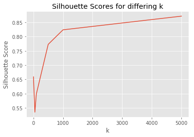
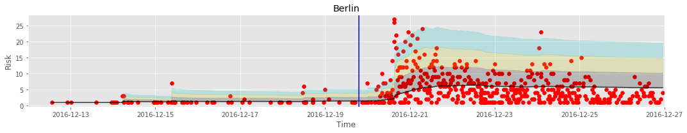
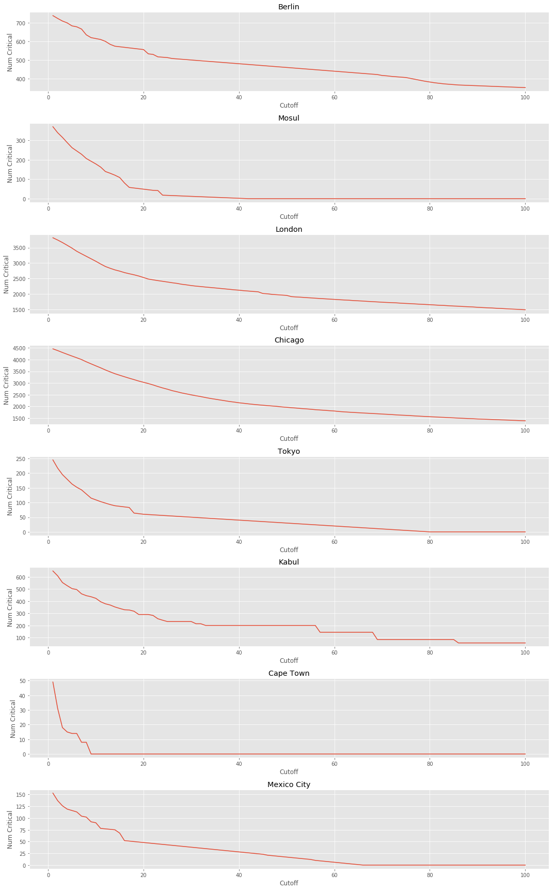
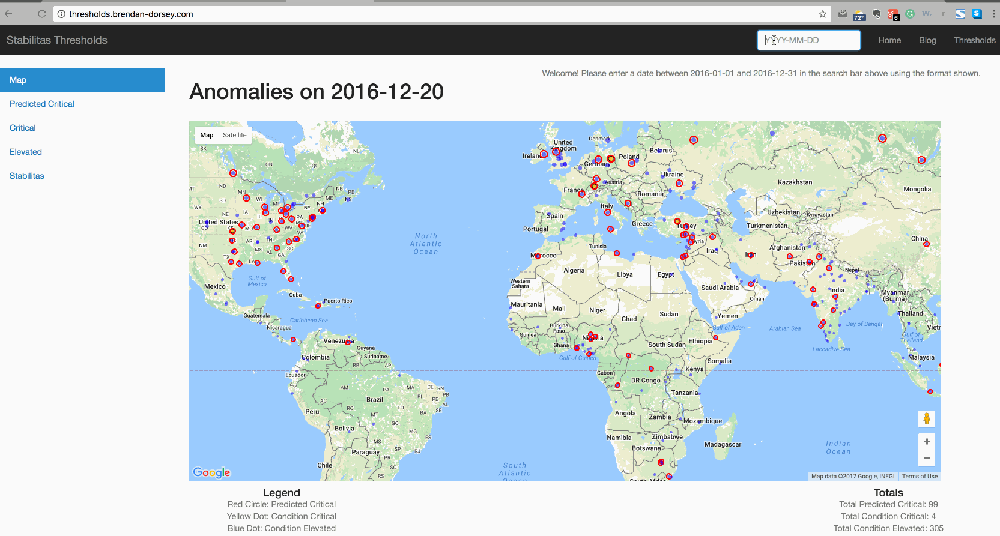
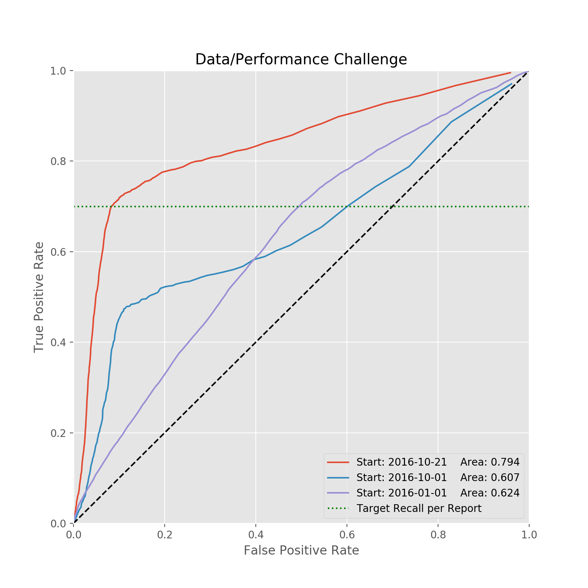

# [Stabilitas Thresholds](http://thresholds.brendan-dorsey.com)

#### Critical Event Detection Dashboard
- Galvanize Data Science - Summer 2017 - Capstone Project - Brendan Dorsey
- Completed in partnership with [Stabilitas](http://stabilitas.io).

## Project Background 
How can Stabilitas alert customers to likely critical events as quickly as possible? 
Their customers are primarily security managers who need to stay informed about high 
risk events around the world at all times. Current methods for global information 
monitoring involve manual scanning of dozens of news sources, or monitoring an 
information feed like that provided by Stabilitas. These methods generate tens of 
thousands of reports every day and make it difficult for security professionals
to identify the most important information quickly.

## Goals
1. **Identify All Critical Events** - Ensure recall per critical event is greater than
90%
2. **Minimize Noise** - Keep the false positive rate as low as possible to filter out
non-critical information.
3. **Prioritized Dashboard** - Provide a web app that assists users in prioritizing 
investigations and responses to possible critical events.

## Pipeline
Visualization of the project pipeline is under construction.

### Quantifying Regional Risk
This has two subphases. First, we need to define regions. Second, we need to derive a 
feature from the data that quantifies the risk in each of those regions at any given 
time.

#### Defining Regions
I started with  Kmeans clustering from SKLearn to determine an optimal number of 
regions to use given the data I had. I used silhouette scores to determine that ~1000-
1500 clusters was ideal. I used cities data from 
[GeoNames](http://http://download.geonames.org/export/dump/) and determined that 
there are 1375 cities with population 300,000 or greater. 

**I used these 1375 cities as the centroids for clustering the data, and then mapped 
each report to the closest of those cities as measured by haversine distance.**

#### Quantifying Risk
I explored a range of engineered features to assess the risk level in each city at 
any given time. Stabilitas assigns machine generated severity scores to each report. 
These scores are, in increasing order: low, moderate, medium, high, and extreme. I 
explored using these scores on a 1-5 scale, on a quadratic scale, and on an 
exponential scale, as well as just using the raw number of reports. The quadratic 
score did the best job at highlighting reports with abnormally high risk scores, and
volume scoring was comparable. To determine the risk over a given time interval, I
explored both summing and averaging the cumulative risk in each interval. Summing 
provided the best results, as it captures bursts of reports more reliably. Finally, I
had to choose a minimum time increment to measure. 3 minute increments proved to have
quick response times to new data and enough breadth to capture trends and changes in 
trends. Putting all of these together, my quadratic scoring feature was overly 
sensitive to large numbers of medium risk reports, so I applied a log transformation
to the sum for each increment to rescale the results. This provided excellent
performance, but still narrowly underperformed compared to volume-based scoring. 

**Risk is quantified as the total number of reports mapped to a given city, 
calculated in 3 minute increments.**

### Labeling Data
With risk quantified, I could start to consider what I wanted to identify and 
predict. This is fundamentally an anomaly detection problem, and anomaly detection in 
timeseries is the approach I took. I calculated the rolling mean and rolling standard
deviation over a one week window for each city. I defined anomalous time increments 
as those with a risk score greater than one standard deviation above the mean (again, 
over the previous week). I explored using other multiples of the standard deviation
but larger values missed initial reports of critical events while smaller values 
generated flagged too many reports to be useful. All of the reports that made up anomalous time increments were labeled as "elevated" risk. "Elevated" reports were
labeled as "critical" if there were more than 30 other "elevated" reports in the same
city over the following 24 hours. I explored a range of options for this threshold, 
and 30 was the smallest value that eliminated cities that didn't experience sustained
bursts of reporting. 

**"Elevated" reports (a.k.a. anomalies) are more than 1 standard deviation above the 
mean over the preceding week.**
**"Critical" reports are "elevated" reports with more than 30 other "elevated" 
reports in the same city over the following 24 hours.**

### Predicting Anomaly Bursts
The labeled data was passed to a pair of Random Forest Classifiers, as implemented by
SKLearn. One of these classifiers was used in conjunction with TF-IDF Vectorization 
to complete Natural Language Processing on the report headlines. The other uses the
report metadata (city, severity score, and event type) as categorical features. These
classifiers are ensembled by taking a weighted average of their predicted 
probabilities for each report, where the meta-data classifier is given twice the 
weight of the natural language classifier. The meta-data classifier offers much more
precision, but future work will include tuning the weighting parameter.

**Final model is an ensemble of Random Forest Classifiers that uses NLP (Natural 
Language Processing) and metadata to predict the probability a given report will 
correlate to an anomaly burst in the next 24 hours.**

### Tech Stack
Data processing was perfomed in Python using pandas, NumPy, and Sci-Kit Learn. Data 
visualizations were made through matplotlib. Processing, modelling, and 
cross-validated grid searches were performed on an AWS EC2 instance. The web 
application is flask based, using Python, JSON objects, and JavaScript to build an 
interactive bootstrap-based dashboard. The web app is hosted on its own AWS EC2 
webserver.

## Next Steps
  
The most challenging aspect of this project was unusual behavior from the model as I
applied it to larger time windows. Specifically, performance on data from October 21, 
2016 until the end of the year was excellent, but dropped sharply across all metrics 
on data from October 11 to the end of the year. This trend continued steadily as more
data was added, and indicates a serious underlying issue in the data. I am still 
investigating potential causes and solutions, and this will be my primary focus until
that issue is resolved. 

Possible causes are seasonality, inconsistent patterns within the data, increase 
noise in some months (making an already heavily unbalanced classes much more 
extreme). There may have also been a distinct change in the data processing pipeline
at Stabilitas. Each of these possibilities will require a different technique to 
address, so more investigation is the first step.
